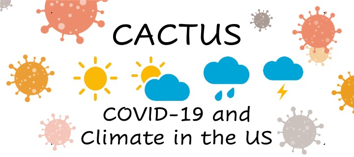

<space>
      

# Overview

Give really basic overview of the project here - go into more detail in the report tab; also give break down of what will be seen in each tab maybe?

### Report

This tab includes detailed information on the project. (add more later)

### Descriptives

One part of our project was to ask specific questions regarding COVID-19 and climate, such as how new daily COVID-19 cases and deaths change in the past year between states that are temperate and sub-tropical, red/blue states as per 2020 election, and between US cities among those are most populated compared to less populated counties. Also we wanted to see whether the important national events have an effect on the trend of COVID-19 cases and deaths.

### Interactive Plots

In order for people to get a better idea of the trends seen in the data, we created interactive maps to allow viewers to choose what variables they would like to see and help them better visualize the information. This includes trends graphs of COVID-19 data by state over time, a map of the U.S. displaying COVID-19 and climate data for each state depending on the month and day chosen by the user, as well as a graph to visualize temperature trends by state over time.

### Predictive Tool

We were interested in seeing how the case counts might be next year, so created a predictive tool

# Screencast
